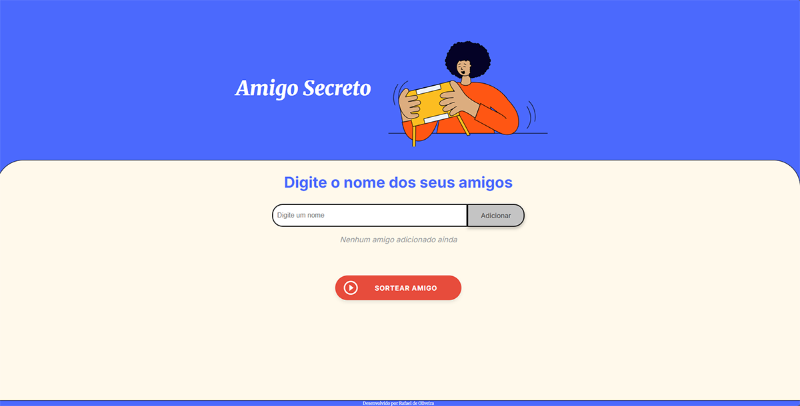
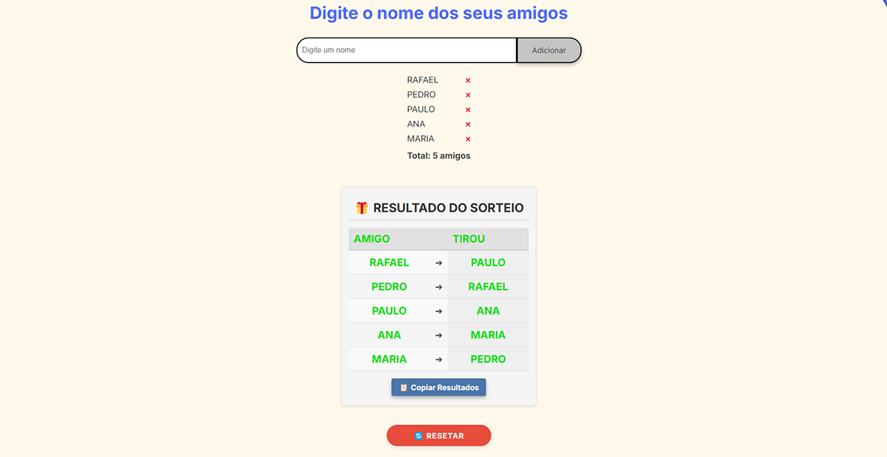

# 🎁 Sorteio de Amigo Secreto



Um aplicativo web simples para realizar sorteios de **Amigo Secreto**. Ele permite adicionar participantes, sortear os pares e copiar os resultados para compartilhamento. Ideal para reuniões familiares, confraternizações entre amigos ou eventos corporativos, tudo isso com uma interface fácil e intuitiva.


## 📋 Sobre o Projeto

Este sorteador de amigo secreto foi desenvolvido com JavaScript puro, HTML e CSS. E permite que você organize facilmente um sorteio para eventos entre amigos, família ou colegas de trabalho. O sistema garante que ninguém tire o próprio nome e oferece uma interface amigável para gerenciar sua lista de participantes.


## ✨ Funcionalidades

- ✅ Adicionar participantes à lista
- ❌ Remover participantes individualmente
- 🔄 Realizar sorteio automático
- 🔍 Visualizar resultado com quem tirou quem
- 📋 Copiar resultados para área de transferência
- 🔁 Reiniciar o sorteio para uma nova rodada
- 🛡️ Proteção contra sorteios inválidos (onde alguém tira o próprio nome)




## 🧠 Algoritmo de Sorteio

O sistema utiliza o algoritmo Fisher-Yates para embaralhar a lista de participantes de forma aleatória e imparcial. A lógica foi implementada com verificações para garantir que ninguém seja sorteado para si mesmo, com um limite de tentativas para evitar loops infinitos em casos extremos.


## 🚀 Como Usar

### Pré-requisitos

- Navegador moderno (Chrome, Firefox, Edge, etc.).
- Conexão com a internet (para carregar recursos externos, se houver).
- Acesse: https://challenge-desafio-amigo-secreto.vercel.app/

### Passo a Passo

1. **Adicionar Participantes:**
   - Digite o nome de um participante no campo de entrada e pressione **Enter** ou clique no botão de adicionar.
   - O nome será adicionado à lista de participantes.

2. **Remover Participantes:**
   - Ao lado de cada nome na lista, há um botão **✖** para remover o participante.

3. **Realizar o Sorteio:**
   - Clique no botão **🎲 Sortear amigo** para iniciar o sorteio.
   - O sistema embaralha os nomes e exibe os pares sorteados em uma tabela.

4. **Copiar Resultados:**
   - Após o sorteio, clique no botão **📋 Copiar Resultados** para copiar os pares para a área de transferência.

5. **Resetar o Sorteio:**
   - Para reiniciar o sorteio, clique no botão **🔄 Resetar**.
   - Todos os participantes e resultados serão removidos.


## 🖥️ Tecnologias Utilizadas

- **HTML:** Estrutura da página.
- **CSS:** Estilização e design responsivo.
- **JavaScript:** Lógica do sorteio e interatividade.
- **Algoritmo Fisher-Yates:** Embaralhamento justo dos participantes.


## 📂 Estrutura do Projeto

```
sorteio-amigo-secreto/
├── assets              # Diretório de imagens
├── index.html          # Página principal
├── style.css           # Estilos da aplicação
├── script.js           # Lógica do sorteio
└── README.md           # Documentação do projeto
```


## 🛠️ Como Executar Localmente

1. Clone o repositório:
   ```bash
   git clone https://github.com/srkael/challenge-desafio-amigo-secreto.git
   ```

2. Navegue até a pasta do projeto:
   ```bash
   cd challenge-desafio-amigo-secreto
   ```

3. Abra o arquivo `index.html` no seu navegador:
   - Clique duas vezes no arquivo ou use um servidor local (como o Live Server do VS Code).


## 🎨 Design e Interface

A interface foi projetada para ser simples e intuitiva, com:
- Botões coloridos e interativos.
- Feedback visual ao copiar resultados.
- Tabela organizada para exibir os pares sorteados.


## 🐛 Problemas Conhecidos

- **Limite de Participantes:** O algoritmo pode falhar se houver muitos participantes (acima de 100) devido ao limite de tentativas de embaralhamento.
- **Compatibilidade:** Testado apenas em navegadores modernos. Pode não funcionar corretamente em versões antigas.
- **Responsividade:** para funciona em dispositivos móveis, tablets e desktops.


## 🤝 Como Contribuir

Sinta-se à vontade para contribuir com o projeto, encontrou um bug ou tem uma sugestão? Abra uma [issue](https://github.com/srkael/challenge-desafio-amigo-secreto/issues) ou envie um pull request.


## 👨‍💻 Autor

- **Rafael de Oliveira Pereira**
- GitHub: [srkael](https://github.com/srkael)
- Linkedin: [Rafael de Oliveira](https://www.linkedin.com/in/srkael/)


## 🙏 Agradecimentos

- Inspirado em projetos de sorteio online.
- Agradecimento especial à Oracle e à Alura pela oportunidade. Participar do programa ONE tem sido uma experiência incrível, repleta de aprendizado e crescimento. Também agradeço à comunidade de desenvolvedores por compartilhar conhecimento..


---

